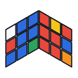

<div align="center">



# CubeAlgos

**A fast, readable Rubik's Cube solver in modern C++.**

Kociemba's two-phase algorithm with a full combination search — every scramble solved
in about 20 moves, in a fraction of a second, with no dependencies beyond a C++17 compiler.

[](#building)
[](#testing)
[](LICENSE)
[](#building)

<!-- Terminal recording goes here. Drop the file at docs/assets/demo.gif and uncomment: -->
<!--  -->

</div>

---

## Why CubeAlgos

|  |  |
|---|---|
| **Short solutions** | ~20.2 moves on average, never more than 22 across 300 random scrambles |
| **Fast** | ~0.15 s per solve, 0.33 s of one-time table building, 21 MB of tables |
| **No dependencies** | A C++17 compiler and `make`. Nothing to install, nothing to vendor |
| **Readable** | A cubie model and plain IDA\*, written to be followed rather than golfed |
| **Verified** | 78 tests, pinned against external ground truth — not just self-consistency |
| **Extensible** | Solving methods are rows in a table; adding one touches no existing code |

## Quick start

```sh
git clone https://github.com/godking123/CubeAlgos.git
cd CubeAlgos
make            # builds ./cubealgo and ./tests
./cubealgo
```

`cubealgo` builds every method's tables, asks which method to solve with, then
scrambles and solves on each ENTER:

```
$ ./cubealgo
Building tables...
Ready.

Rubik's Cube Solver
───────────────────
    1) Kociemba — two-phase IDA* search, 18-22 moves
    2) CFOP — cross, F2L, OLL, PLL (not implemented)
    3) Roux — blocks, CMLL, LSE (not implemented)

Method number: 1

Solving with Kociemba.
Press ENTER to generate a new scramble and solve it.
Type 'm' to change method, 'q' to quit.

[ Press ENTER ]
Scramble: L2 D B F2 R2 U2 L2 B' D2 U L F U D2 B D L' U' L2 R
Solving with Kociemba...
Method:   Kociemba
Solution: R F D2 B' U2 R D B U R F D F2 D R2 F2 R2 U2 B2 D'
Moves:    20
Time:     44.6295 ms
Solved:   YES
```

## Use it as a library

Every solver exposes the same two calls. Build the tables once at startup, then solve
as many cubes as you like:

```cpp
#include "CubeState/CubeAlgos.h"
#include "Solvers/Kociemba/Kociemba.h"

Kociemba::buildTables();                    // once, ~0.33 s

CubeState s = CubeState::solved();
for (Move m : parseSequence("R U R' U' F2 D B'"))
    s = s.apply(m);

for (Move m : Kociemba::solve(s))
    s = s.apply(m);

assert(s.isSolved());
```

`CubeState` is a value type — `apply` returns a new state and never mutates. A state is
40 bytes, so passing them around and copying them is cheap.

<details>
<summary><b>Full API reference</b></summary>

### State

| Function | Behavior |
|---|---|
| `CubeState::solved()` | the identity state |
| `CubeState::apply(Move)` | returns a new state; does not mutate |
| `CubeState::isSolved()` | true when every piece is home and unoriented |
| `moveName(Move)` | move → notation string |
| `parseMove(const std::string&)` | notation → move; throws `std::invalid_argument` |
| `parseSequence(const std::string&)` | whitespace-separated notation → `std::vector<Move>` |
| `sequenceName(const std::vector<Move>&)` | sequence → space-separated notation |
| `randomScramble(int length = 25)` | a canonical random scramble, seeded from `std::random_device` |
| `randomScramble(int length, uint64_t seed)` | the same, reproducible for a given seed |

`parseMove` and `parseSequence` throw `std::invalid_argument` on an unrecognized token,
so callers handling user input should wrap them in `try`/`catch`.

### Solving

| Function | Behavior |
|---|---|
| `Kociemba::buildTables()` | fills every coordinate and pruning table; call once |
| `Kociemba::solve(const CubeState&)` | the full solver; solves any state |
| `Phase1::solve(const CubeState&)` | shortest moves reducing any state to G1; ≤ 12 moves |
| `Phase1::forEachSolution(s, len, fn)` | every way into G1 in exactly `len` moves |
| `Phase2::solve(const CubeState&, maxMoves, lastMove)` | moves solving a G1 state; G1 generators only |

The phases are callable individually. Phase 2 assumes its input is already in G1, so it
must be given the state *after* phase 1 is applied. All of these return an empty
sequence when their goal is already met.

</details>

## How it works

Solving runs in two phases. **Phase 1** reduces the cube to the subgroup
`G1 = <U, D, R2, L2, F2, B2>` — every piece oriented and the four slice edges back in
the slice — in at most 12 moves. **Phase 2** then solves it inside G1, where only those
ten moves are legal. Each phase is an IDA\* search over packed coordinates, guided by a
pruning table built by breadth-first search out from the goal.

<!-- Diagram of the two-phase reduction goes here: docs/assets/phases.png -->

### The combination search

Taking the first phase 1 solution and finishing it is what makes a two-phase solver
easy to write, and it is also what makes it long-winded. G1 is a large set, and *where*
phase 1 lands inside it decides how much work phase 2 inherits — a phase 1 that is one
move longer will often enter G1 somewhere phase 2 can finish several moves sooner.

So `Kociemba::solve` never commits to a single phase 1. It walks the phase 1 solutions
by length, runs phase 2 on each one with a budget of one move less than the best total
found so far, and keeps the best combination:

```
for each phase 1 length, shortest first:
    for every phase 1 solution of exactly that length:
        solve phase 2 from there, capped at (best so far − length − 1)
        keep the combination if it beats the incumbent
    stop once nothing shorter is reachable
```

Each phase 2 run either beats the incumbent or gives up almost immediately, so the
budget pays for the extra candidates. Over 300 random scrambles:

| | First solution found | Combination search |
|---|---|---|
| Average | 23.0 moves | **20.2 moves** |
| Range | 19 – 26 | **18 – 22** |
| Time per solve | ~9 ms | ~150 ms |

Phase 2 also refuses to start on the face phase 1 ended on, so the two halves can never
be joined by a pair of moves that collapses into one and quietly inflates the count.

### State representation

The cube is a **cubie model** rather than 54 stickers: eight corner pieces and twelve
edge pieces, each with a position and an orientation. Moves are applied by table lookup,
which keeps state transitions cheap enough to sit underneath the search.

<details>
<summary><b>Slots, orientation, and move tables</b></summary>

`CubeState` holds four arrays:

| Field | Size | Meaning |
|---|---|---|
| `cp` | 8 | corner permutation — which corner piece sits in each corner slot |
| `co` | 8 | corner orientation, 0–2 (clockwise twists) |
| `ep` | 12 | edge permutation |
| `eo` | 12 | edge orientation, 0–1 (flipped or not) |

Slot indices are fixed:

```
Corners: URF=0 UFL=1 ULB=2 UBR=3 DFR=4 DLF=5 DBL=6 DRB=7
Edges:   UR=0  UF=1  UL=2  UB=3  DR=4  DF=5  DL=6  DB=7
         FR=8  FL=9  BL=10 BR=11
```

Orientation follows the usual convention: `U`/`D` turns twist no corners, and only
`F`/`B` turns flip edges.

`MOVE_TABLES[m]` stores, for each destination slot, the slot its piece comes from, plus
the orientation delta:

```cpp
next.cp[i] = cp[t.cp[i]];
next.co[i] = (co[t.cp[i]] + t.co[i]) % 3;
```

</details>

## Move notation

The eighteen half-turn-metric moves are supported:

| | Clockwise | Half turn | Counter-clockwise |
|---|---|---|---|
| Up | `U` | `U2` | `U'` |
| Right | `R` | `R2` | `R'` |
| Front | `F` | `F2` | `F'` |
| Down | `D` | `D2` | `D'` |
| Left | `L` | `L2` | `L'` |
| Back | `B` | `B2` | `B'` |

Notation is case-sensitive: `r` is rejected rather than silently read as `R`.

## Building

Requires a C++17 compiler and `make`. There are two binaries; they share the same state
layer and differ only in which file supplies `main()`.

```sh
make        # builds both ./cubealgo and ./tests
make test   # builds ./tests and runs it
make clean  # removes binaries and object files
```

## Testing

```sh
make test
```

78 tests covering the group structure (move orders, commuting and non-commuting face
pairs, permutation validity, orientation-sum and parity invariants), both phases'
coordinate encodings, move tables and pruning tables, the solvers, the method table,
scramble generation, and move parsing. The run takes about eight seconds, most of it
spent solving real scrambles end to end. It exits non-zero on failure, so `make test`
fails the build with it.

A move table wired up backwards still satisfies every self-consistency check, so
several tests deliberately pin against outside results:

- **Superflip.** The canonical 20-move sequence must leave all eight corners solved and
  all twelve edges in place but flipped — pinning `cp`, `co`, `ep` and `eo` against an
  external result rather than against each other. This is the check that originally
  caught `F`/`F'` and `D`/`D'` having their edge-permutation arrays swapped: each move
  was still the exact inverse of the other, so every self-consistency test passed.
- **Known algorithm orders.** `(R U)` has order 105, `(R U')` 63, `(R U2)` 30, and the
  T-perm order 2. A move table whose edge cycle runs the wrong way still has order 4, so
  these pin the cycle direction against published values.
- **Heuristic admissibility.** A state reached in `n` moves must have a heuristic of at
  most `n`. IDA\* returns an optimal solution only if the heuristic never overestimates,
  and an inadmissible one silently returns longer solutions instead of failing.
- **End-to-end solves.** Scrambles must come back solved after a full solve. Every
  table, coordinate and search in the project feeds into this one assertion.

## Adding a solving method

`Solvers/Method.h` defines the interface the front end talks to:

```cpp
struct Method {
    const char* name;
    const char* description;
    bool implemented;
    void (*buildTables)();
    std::vector<Move> (*solve)(const CubeState& s);
};
```

To add one: create `Solvers/<Name>/`, write `<Name>.h` and `<Name>.cc` exposing
`buildTables` and `solve` in a `<Name>` namespace, add a row to `METHODS` in
`Solvers/Method.cc`, and add the source to `SOLVERS` in the Makefile. `Main.cc` needs no
changes — it iterates the table.

`implemented` is what the menu gates on. Leave it `false` until the method solves: one
test asserts that placeholders return no moves, and another asserts that every method
claiming `implemented` actually solves.

CFOP and Roux are wired up this way already, as placeholders waiting to be filled in.

## Project layout

```
Main.cc                  cubealgo — method menu, scramble-and-solve prompt
Tests.cc                 the test suite
Makefile

CubeState/               the state layer; knows nothing about solving
  CubeState.h/.cc          Move enum, CubeState, state ops, notation parsing
  MoveTable.h/.cc          the 18 move tables
  Scramble.h/.cc           scramble generation and sequence printing
  CubeAlgos.h              umbrella header for the state layer

Solvers/
  Method.h                 the interface Main talks to
  Method.cc                the METHODS table — one row per method
  Kociemba/
    Coords.h/.cc             coordinate encode/decode for both phases
    CoordTables.h/.cc        move and pruning tables, indexed by coordinate
    Phase1.h/.cc             reduce to G1; shortest, or every one of a given length
    Phase2.h/.cc             solve within G1, inside a move budget
    Kociemba.h/.cc           builds the tables, searches phase 1/phase 2 combinations
  CFOP/
  Roux/
```

## Roadmap

- [x] Cubie model, move tables, notation parsing, scramble generation
- [x] Kociemba two-phase solver with combination search
- [ ] CFOP
- [ ] Roux
- [ ] State import from a facelet string
- [ ] Slice, wide and rotation moves (`M`, `E`, `S`, `r`, `u`, `x`, `y`, `z`)
- [ ] Optimal solver

## Contributing

Issues and pull requests are welcome. A few things that make review easy:

- `make test` passes, and new behavior comes with a test
- New code matches the surrounding style — the codebase favors being readable and
  obviously correct over being fast
- One change per pull request

## License

Released under the [MIT License](LICENSE).

## Acknowledgements

Built on [Herbert Kociemba's two-phase algorithm](https://kociemba.org/cube.htm), and
on the coordinate and pruning-table scheme described alongside it.
